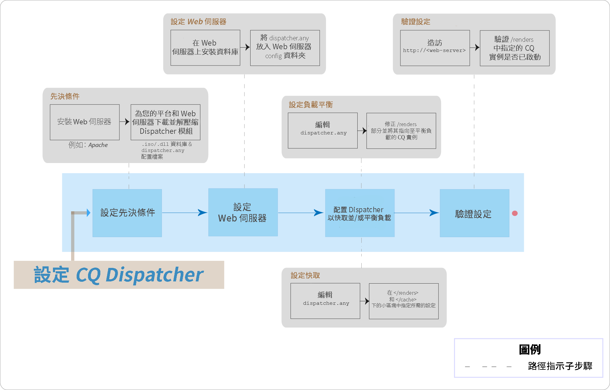

# AEM Dispatcher 熱門問題常見問題集



## 簡介

### 什麼是 Dispatcher？

Dispatcher 是 Adobe Experience Manager 的快取及/或負載平衡工具，可協助實現快速且動態的網頁撰寫環境。 對於快取，Dispatcher 會當作 HTTP 伺服器 (例如 Apache) 的一部分來運作。 其目的是為了儲存 (或「快取」) 盡可能多的靜態網站內容，並盡量少存取網站的版面引擎。 在負載平衡角色中，Dispatcher 會將使用者請求 (負載) 分散到不同的 AEM 執行個體 (轉譯器)。

對於快取，Dispatcher 模組會使用網頁伺服器的功能提供靜態內容。 Dispatcher 會將快取的文件置於網頁伺服器的主目錄。

### Dispatcher 如何執行快取？

Dispatcher 會使用網頁伺服器的功能提供靜態內容。 Dispatcher 會將快取的文件存放於網頁伺服器的主目錄。 Dispatcher 有兩種主要方法，用於在對網站進行更改時更新快取內容。

* **內容更新**&#x200B;會移除已變更的頁面，以及與其直接相關的檔案。
* **自動失效**&#x200B;功能會自動讓那些在更新後可能過期的快取失效。例如，此功能會有效地將相關頁面標示為過期，而不會刪除任何內容。

### 負載平衡有哪些優點？

負載平衡在多個 AEM 執行個體之間分配使用者請求 (負載)。 下表描述了負載平衡的優點：

* **提高處理能力**：在實務中，此方法表示 Dispatcher 會將文件請求在數個 AEM 執行個體之間分享。 由於每個執行個體要處理的文件數量較少，所以您的回應時間就會變快。 Dispatcher 會保留每個文件類別的內部統計資料，以便能夠估計負載並有效率地分配查詢。
* **增加防故障的涵蓋範圍**：如果 Dispatcher 沒有收到來自執行個體的回應，就會自動將請求轉送給其他執行個體之一。 因此，如果某個執行個體無法使用，唯一的影響是網站速度變慢，與失去的運算能力成正比。

>[!NOTE]
>
>如需詳細資訊，請參閱 [Dispatcher 總覽頁面](dispatcher.md)

## 安裝與設定

### 要從哪裡下載 Dispatcher 模組？

您可以從 [Dispatcher 發行說明](release-notes.md)頁面下載最新的 Dispatcher 模組。

### 該如何安裝 Dispatcher 模組？

請參閱[安裝 Dispatcher](dispatcher-install.md) 頁面

### 該如何設定 Dispatcher 模組？

請參閱[設定 Dispatcher](dispatcher-configuration.md) 頁面。

### 該如何為編寫執行個體設定 Dispatcher？

如需詳細步驟，請參閱[搭配編寫執行個體使用 Dispatcher](dispatcher.md#using-a-dispatcher-with-an-author-server)。

### 該如何為 Dispatcher 設定多個網域？

您可以為 CQ Dispatcher 設定多個網域，前提是這些網域符合以下條件：

* 這兩個網域的網頁內容都儲存在單一 AEM 存放庫中
* 可以個別針對每個網域讓 Dispatcher 快取中的檔案失效

如需詳細資訊，請閱讀[在多個網域中使用 Dispatcher](dispatcher-domains.md)。

### 該如何設定 Dispatcher 好讓來自某個使用者的所有請求都路由傳送到相同的 Publish 執行個體？

您可以使用[黏性連線](dispatcher-configuration.md#identifying-a-sticky-connection-folder-stickyconnectionsfor)功能，此功能可確保某個使用者的所有文件都會在 AEM 的相同執行個體上處理。 如果您使用個人化頁面和工作階段資料，此功能會很重要。 資料會儲存在執行個體上。 因此，來自相同使用者的後續請求必須傳給該執行個體，否則資料會遺失。

由於黏性連線會限制 Dispatcher 最佳化請求的能力，因此您應該視需要使用此做法。 您可以指定包含「黏性」文件的資料夾，藉此確保該資料夾中的所有文件都會在使用者的相同執行個體上處理。

### 我可以同時使用黏性連線和快取嗎？

針對大多數使用黏性連線的頁面，您應該關閉快取。 否則會對所有使用者顯示該頁面的相同執行個體，無論工作階段內容為何。

對於某些應用程式，可以同時使用黏性連線和快取。 例如，如果您顯示的表單會將資料寫入工作階段，您就可以同時使用黏性連線和快取。

### Dispatcher 和 AEM Publish 執行個體可以位在相同的實體電腦上嗎？

可以，如果電腦的能力夠強大的話。 不過，建議您在不同電腦上設定 Dispatcher 和 AEM Publish 執行個體。

通常 Publish 執行個體位在防火牆內，Dispatcher 則位在 DMZ 中。 如果您決定讓 Publish 執行個體和 Dispatcher 位在相同實體電腦上，請確定防火牆設定會禁止直接從外部網路存取該 Publish 執行個體。

### 我可以只快取特定副檔名的檔案嗎？

可以。 例如，如果您只想要快取 GIF 檔案，請在 dispatcher.any 設定檔案的快取區段中指定 *.gif。

### 如何從快取中刪除檔案？

您可以使用 HTTP 請求從快取中刪除檔案。 收到 HTTP 請求時，Dispatcher 就會從快取中刪除檔案。 Dispatcher 只有在收到頁面的用戶端請求時才會再次快取檔案。 以這種方式刪除快取檔案適用於不太可能接收相同頁面的同時請求的網站。

HTTP 請求具有以下語法：

```
POST /dispatcher/invalidate.cache HTTP/1.1
CQ-Action: Activate
CQ-Handle: path-pattern
Content-Length: 0
```

Dispatcher 會刪除名稱符合 CQ-Handle 標頭值的快取檔案和資料夾。 例如，`/content/geomtrixx-outdoors/en` 的 CQ-Handle 符合以下項目：

geometrixx-outdoors 目錄中所有名為 en 的檔案 (任何副檔名)
en 目錄下任何名為 `_jcr_content` 的目錄 (如果存在，則包含頁面的子節點的快取轉譯)
目錄 `en` 只有當 `CQ-Action` 為`Delete` 或`Deactivate` 時才會刪除。

如需這個主題的詳細資訊，請參閱[手動讓 Dispatcher 快取失效](page-invalidate.md)。

### 該如何實作權限敏感型快取？

請參閱[快取安全內容](permissions-cache.md) 頁面。

### 該如何維護 Dispatcher 與 CQ 執行個體之間的通訊安全？

請參閱 [Dispatcher 安全性檢查清單](security-checklist.md)和 [AEM 安全性檢查清單](https://experienceleague.adobe.com/docs/experience-manager-64/administering/security/security-checklist.html?lang=zh-Hant)頁面。

### Dispatcher 問題：`jcr:content` 已變成 `jcr%3acontent`

**問**：企業最近在 Dispatcher 層級遇到了問題。 從 CQ 存放庫獲取一些資料的 AJAX 呼叫之一包含 `jcr:content`。 這被編碼至 `jcr%3acontent` 而導致錯誤的結果集。

**答**：請使用 `ResourceResolver.map()` 方法以使用/發出從中獲得請求的「易記」URL，並解決與 Dispatcher 相關的快取問題。 map() 方法將 `:` 冒號編碼為下劃線，而 resolve() 方法將它們重新解碼為 SLING JCR 可讀格式。 使用 map() 方法產生在 Ajax 呼叫中使用的 URL。

延伸閱讀：[https://sling.apache.org/documentation/the-sling-engine/mappings-for-resource-resolution.html#namespace-mangling](https://sling.apache.org/documentation/the-sling-engine/mappings-for-resource-resolution.html#namespace-mangling)

## 清除 Dispatcher

### 該如何在 Publish 執行個體上設定 Dispatcher 清除代理程式？

請參閱[複寫](https://experienceleague.adobe.com/docs/experience-manager-64/deploying/configuring/replication.html?lang=zh-Hant#configuring-your-replication-agents)頁面。

### 該如何對 Dispatcher 清除問題進行疑難排解？

[請參閱這些疑難排解文章](https://experienceleague.adobe.com/search.html?lang=zh-Hant#q=troubleshooting%20dispatcher%20flushing%20issues&amp;sort=relevancy&amp;f:el_product=[Experience%20Manager])。

如果刪除操作導致 Dispatcher 進行清除，[請使用 Sensei Martin 撰寫的這篇社群部落格文章中所提供的暫行解決方法](https://mkalugin-cq.blogspot.com/2012/04/i-have-been-working-on-following.html)。

### 該如何從 Dispatcher 快取中清除 DAM 資產？

您可以使用「連鎖複寫」功能。 當啟用此功能時，Dispatcher 清除代理程式會在收到來自編寫執行個體的複寫時傳送清除請求。

若要啟用此功能：

1. [依照這裡的步驟](page-invalidate.md#invalidating-dispatcher-cache-from-a-publishing-instance)在發佈執行個體上建立清除代理程式
1. 前往每個代理程式的設定，然後在「**觸發器**」標籤上勾選「**接收時**」方塊。

## 其他

Dispatcher 如何判斷某個文件是不是最新的？
若要判斷某個文件是不是最新的，Dispatcher 會執行以下操作：

它會檢查文件是否會自動失效。 如果不會，則將該文件視為最新版本。
如果文件已設定為會自動失效，Dispatcher 會檢查其是否比最後一次可用變更來得舊或更新。如果版本較舊，Dispatcher 會請求來自 AEM 執行個體的最新版本，並取代快取中的版本。

### Dispatcher 如何傳回文件？

您可以使用 [Dispatcher 設定](dispatcher-configuration.md)檔案 `dispatcher.any` 來定義 Dispatcher 是否會快取文件。 Dispatcher 會根據可快取文件清單來檢查請求。如果文件不在此清單中，Dispatcher 會請求 AEM 執行個體的文件。

`/rules` 屬性可控制根據文件路徑快取哪些文件。 無論 `/rules` 屬性為何，Dispatcher 在以下情況下絕對不會快取文件：

* 請求 URI 包含 `(?)` 問號。
* 這表示這是不需要快取的動態頁面，例如搜尋結果。
* 缺少副檔名。
* 網頁伺服器需要副檔名來判斷文件類型 (MIME 類型)。
* 驗證標題已設定 (可設定)。
* 如果 AEM 執行個體提供以下標頭當作回應：
   * no-cache
   * no-store
   * must-revalidate

Dispatcher 會將快取的檔案儲存在網頁伺服器上，就像是靜態網站的一部分一樣。 如果使用者請求快取的文件，Dispatcher 會檢查該文件是否存在於網頁伺服器的檔案系統中。 如果存在的話，Dispatcher 會傳回文件。 如果不存在的話，Dispatcher 會向 AEM 執行個體請求文件。

>[!NOTE]
>
>Dispatcher 可快取 GET 或 HEAD (用於 HTTP 標頭) 方法。 如需有關回應標頭快取的其他資訊，請參閱[快取 HTTP 回應標頭](dispatcher-configuration.md#caching-http-response-headers)一節。

### 我可以在設定中實作多個 Dispatcher 嗎？

可以。 在這類情況下，請確定這些 Dispatcher 都可以直接存取 AEM 網站。 某個 Dispatcher 無法處理來自其他 Dispatcher 的請求。
